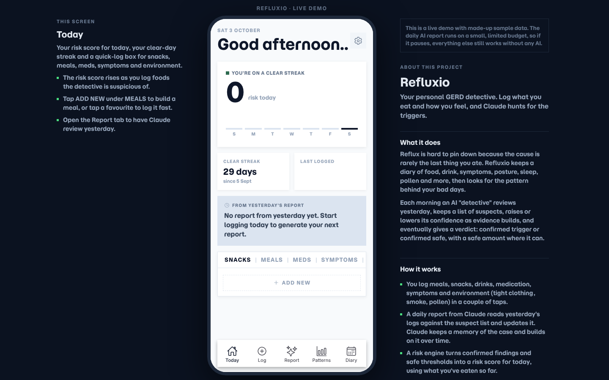
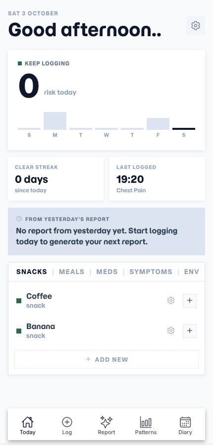
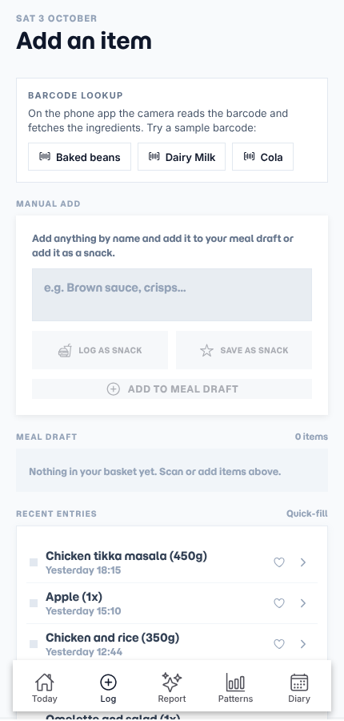
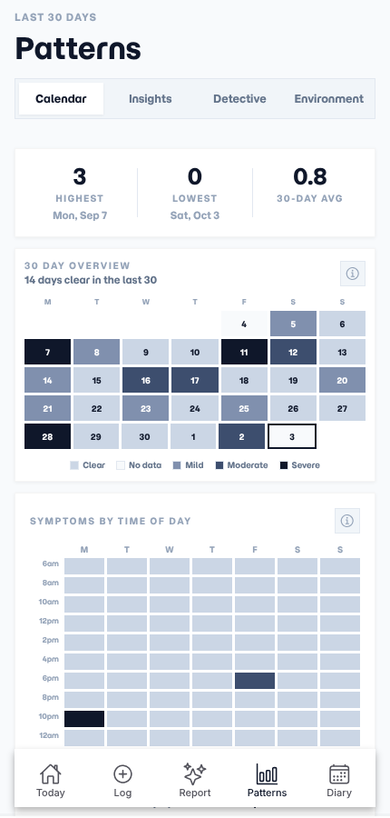
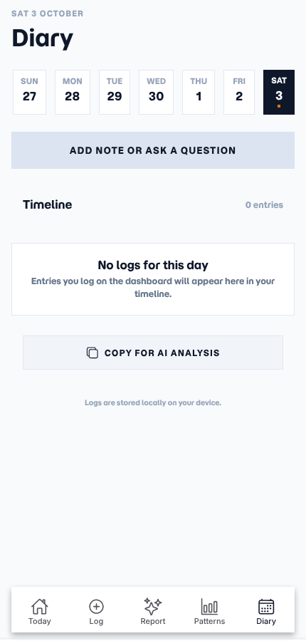

# Refluxio

**A heartburn tracker with a "Gut Detective" that works out what's setting you off.**

Log what you eat, drink and feel. Each day an AI detective reads your diary, builds a suspect list, asks follow-up questions, and learns which foods are safe and in what amounts.



> **Source:** https://github.com/Insightio-Prog/refluxio  
> **Live demo:** https://refluxio.insightio.co.uk  
> The demo starts with sample data. The daily AI report is live but runs on a small shared budget.

## How I made it

I'm a chef, not a trained developer. I can read a little C#, and that's about it. I built Refluxio with **Claude and Cursor**: I decide what the app should do and how it should feel, they write the code, and I test it, break it and send it back. It's the project I'm proudest of, because I wrote it to solve my own problem.

## What it does

| | |
|---|---|
|  |  |
| **Today.** Risk score, weekly bars, clear streak, quick logging. | **Log.** Barcode lookup (Open Food Facts), meal builder, manual entries. |
|  |  |
| **Patterns.** 30-day heatmap, time-of-day chart, detective findings. | **Diary.** A timeline per day, plus notes and questions. |

Also: daily and monthly AI reports, pollen and environment context, and a doctor-friendly PDF export.

## How the detective works

- Suspects get a confidence score from how often they precede symptoms.
- Uncertain ones become **pending investigations**, with a question to the user when more info would help.
- Foods can be marked **tested safe** with a threshold (for example "40g chocolate").
- A risk engine turns this into a daily risk number and guide.
- Everything the AI "remembers" is plain JSON on the device. Settings shows it raw.

## The AI proxy

The browser never talks to Anthropic directly. It calls a small Cloudflare Worker (`worker/worker.js`) that:

- holds the **API key** as a secret
- owns the **model, system prompts and token limits**, so callers only send diary data
- validates requests (shape, size, allowed origins)
- applies **per-visitor and daily rate limits** (Workers KV)
- uses prompt caching and returns a friendly "demo budget used up" state when limits are hit

Replies are validated with **Zod** before the app trusts them.

## Tech

Expo 54, React Native, expo-router (one codebase for phone and web), AsyncStorage (no backend, no account), Zod, Cloudflare Workers + KV. On wide screens the app sits in a phone frame with write-up side panels.

## Run it

```bash
npm install
npx expo start --web      # or: npx expo export -p web
```

Copy `.env.example` to `.env.local` to point at your own AI proxy (see `worker/`). To deploy the Worker: create a KV namespace, put its id in `worker/wrangler.toml`, set `ALLOWED_ORIGINS`, then `npx wrangler secret put ANTHROPIC_API_KEY` and `npx wrangler deploy`.

## Not medical advice

Refluxio is a diary and pattern-spotter, not a medical device.
